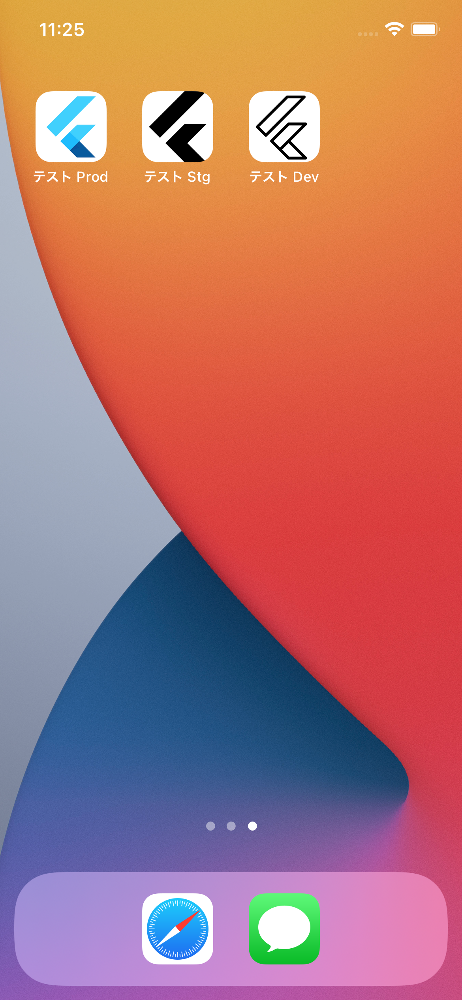

# flutter_multi_env

Switch flutter env by using flavor.

## References
- [Flutter iOSビルド設定切り替え！本番/ステージング/開発環境ごとにビルド設定を切り替える方法【Flutter】
](https://www.youtube.com/watch?v=NLYGsa8HLHI)
- [flutterで本番/ステージング/開発を切り替える](https://qiita.com/ko2ic/items/53f97bb7c28632268b5a)
# flutter_multi_env
